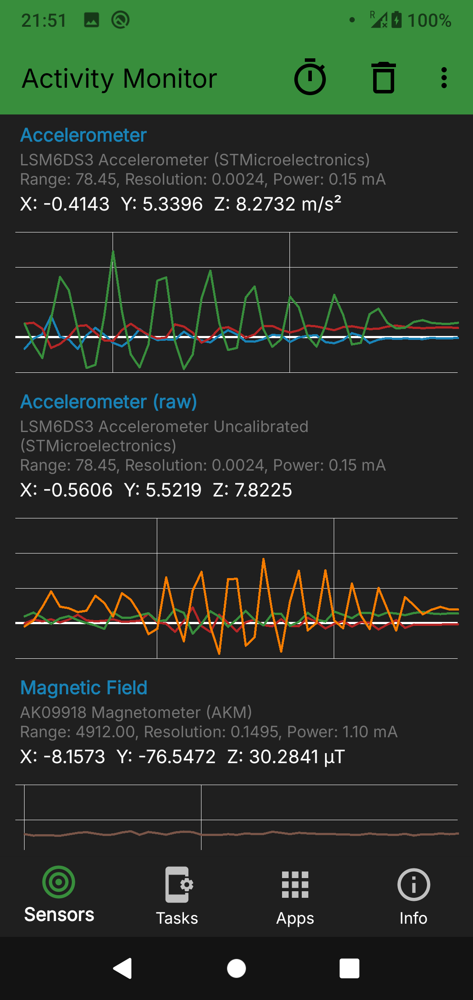
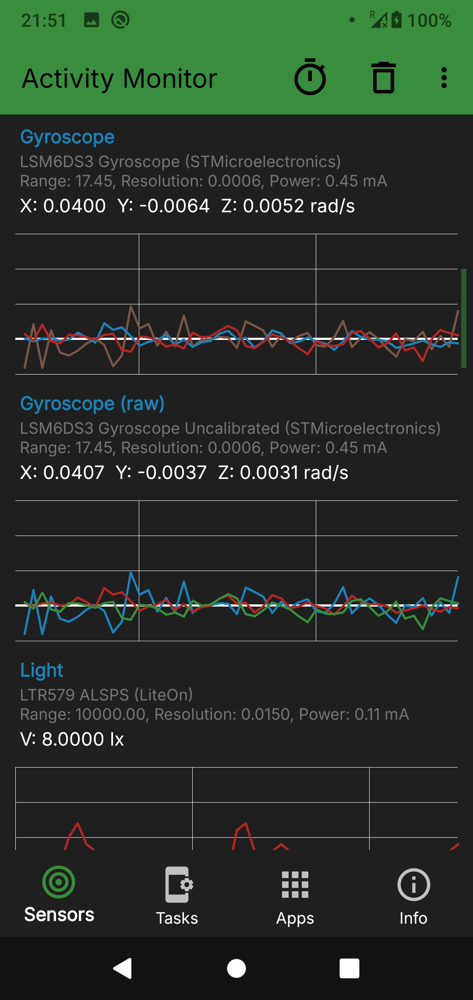
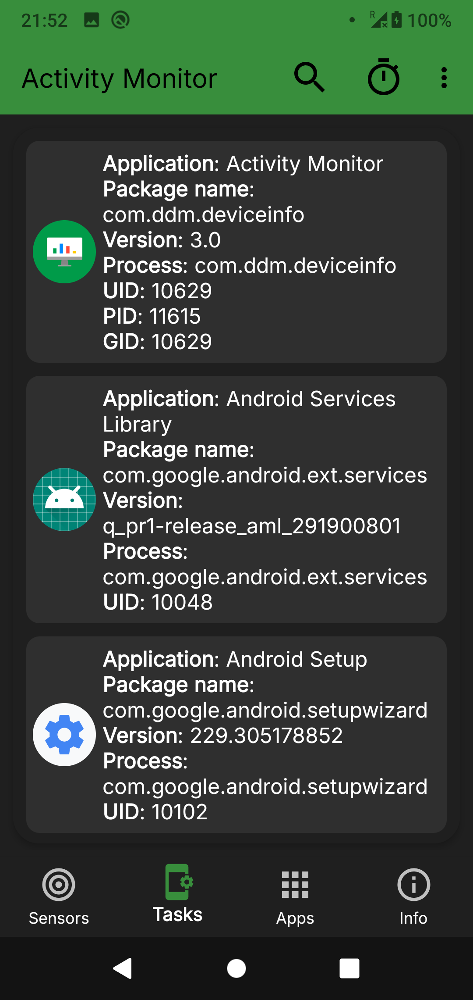
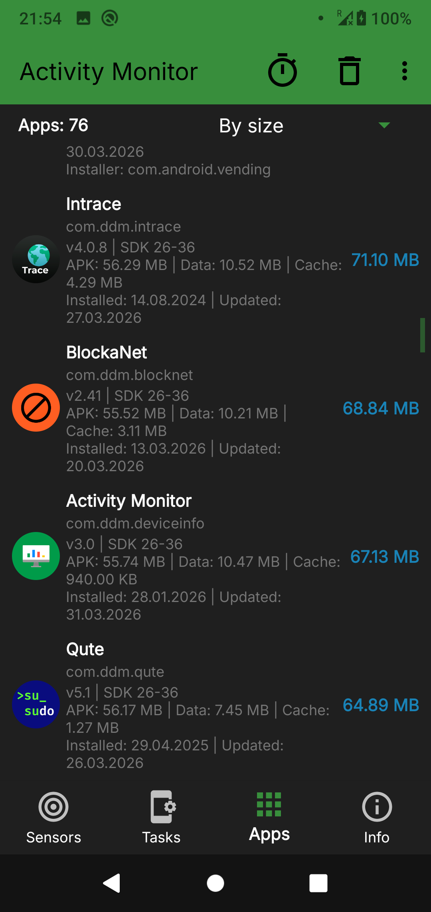

# Activity Monitor
 

Real-time sensor data, installed apps overview, running processes, device info

Activity Monitor is a lightweight app that provides real-time sensor data, a detailed view of installed applications, running process information, and comprehensive device specs — all in one place.

SENSORS
View live data from every sensor on your device: accelerometer, gyroscope, light, pressure, proximity, magnetic field, and more. Each sensor displays real-time values with a live graph, along with detailed specs including vendor, range, resolution, and power consumption.

INSTALLED APPS
Browse all installed applications with detailed information: APK size, cache, data usage, version, target SDK, install and update dates, and installer source. Sort by name, size, install date, or update date to quickly find what you need.

RUNNING PROCESSES
View currently running and recently used applications with process details including package name, version, UID, and usage statistics.

DEVICE INFORMATION
Access complete device specs in one place: memory and storage details, battery status (percentage, voltage, temperature, health, charging source, current draw), SIM card info, display parameters, CPU architecture, NFC status, system sensors and features, OS version, security patch level, bootloader, kernel, and more.

Download activity monitor apk

## Screenshots
<table>
  <tr>
    <td></td>
    <td></td>
    <td></td>
    <td></td>
	</tr>
</table>

## Compatibility
Latest version supports Android 8.0+ (Android APi 26+) and [legacy](https://github.com/BlindZoneApps/activity-monitor-apk/releases/tag/1.50) version for Android 5.0+ (Android API 21+). All architectures.

## EULA & Privacy Policy
By downloading or opening the application, you accept the [user agreement and privacy policy](https://blindzone.org/eula). 
You may not: copy, modify, translate or create derivative works based on the  Activity Monitor ("Software"); distribute, transfer, publish, disclose, sublicense, lease, lend, sell or rent the Software to any third party; reverse engineer, decompile, reverse decompile or disassemble the Software, or otherwise attempt to derive the source code; make the functionality of the Software available to third parties or multiple users through any means, or benchmark or conduct any performance or comparison tests on the Software. BlindZone LLC reserves all rights in and to the Software not expressly granted to you under EULA.
