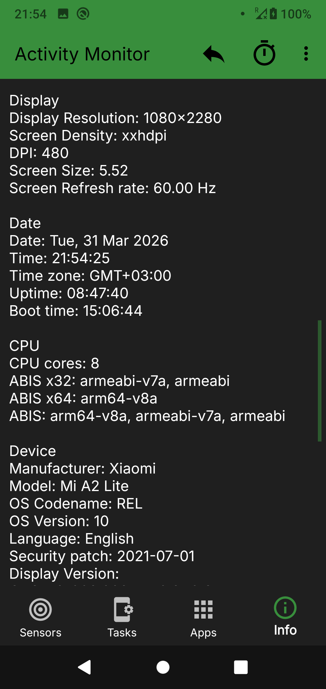

# Activity Monitor

> Real-time sensor data, installed apps overview, running processes, and full device info — all in one lightweight app.

Activity Monitor turns your phone into a transparent dashboard. See exactly what every sensor is reading, which apps are installed and how much space they eat, what's running right now, and the complete hardware and software spec of your device — without ads getting in the way of the data.

## Download

## Features

### 📡 Sensors
View live data from every sensor on your device — accelerometer, gyroscope, light, pressure, proximity, magnetic field, and more. Each sensor shows real-time values on a live graph, plus detailed specs: vendor, range, resolution, and power consumption.

### 📦 Installed apps
Browse all installed applications with detailed information: APK size, cache, data usage, version, target SDK, install and update dates, and installer source. Sort by name, size, install date, or update date to quickly find what you need.

### ⚙️ Running processes
View currently running and recently used applications with full process details, including package name, version, UID, and usage statistics.

### 📱 Device information
Access complete device specs in one place:
* Memory and storage details
* Battery status — percentage, voltage, temperature, health, charging source, current draw
* SIM card info
* Display parameters
* CPU architecture
* NFC status
* System sensors and features
* OS version, security patch level, bootloader, and kernel

## Use cases

* **Find space hogs** — sort installed apps by size, cache, and data usage
* **Check battery health** — monitor voltage, temperature, and charge state in real time
* **Test your hardware** — confirm which sensors your device actually has and that they work
* **See what's running** — review active and recent processes at a glance
* **Know your device** — full hardware and software spec sheet, always up to date

## Screenshots

<table>
  <tr>
    <td></td>
    <td></td>
    <td></td>
    <td></td>
    <td></td>
  </tr>
</table>

## Installing the APK

1. Download the latest `*.apk` from the [Releases page](https://github.com/BlindZoneApps/activity-monitor-apk/releases/latest).
2. On your device, allow installation from unknown sources (Settings → Apps → Special access → Install unknown apps) for your browser or file manager.
3. Open the downloaded APK and tap **Install**.
4. If you previously installed Activity Monitor from Google Play, **uninstall it first** — the Play Store build is signed by Google and the APK won't install over it.

## Compatibility

* **Latest version:** Android 8.0+ (API 26+)
* **Legacy version:** Android 5.0+ (API 21+) — available as [release 1.50](https://github.com/BlindZoneApps/activity-monitor-apk/releases/tag/1.50)
* **Architectures:** all (universal APK)

## FAQ

**Is Activity Monitor free?**
Yes. You can download and use it for free.

**Why does the APK fail to install?**
You most likely have the Google Play version installed. Uninstall it first — the two builds use different signing keys and Android won't let one replace the other.

**Do I need root?**
No. Activity Monitor works on standard, non-rooted devices.

**Which should I download — APK or Google Play?**
Google Play is recommended for automatic updates. Use the APK if you can't access Play or want a specific version.

## EULA & Privacy Policy

By downloading or opening the application, you accept the [user agreement and privacy policy](https://blindzone.org/eula).

You may not: copy, modify, translate or create derivative works based on Activity Monitor ("Software"); distribute, transfer, publish, disclose, sublicense, lease, lend, sell or rent the Software to any third party; reverse engineer, decompile, reverse decompile or disassemble the Software, or otherwise attempt to derive the source code; make the functionality of the Software available to third parties or multiple users through any means, or benchmark or conduct any performance or comparison tests on the Software. BlindZone LLC reserves all rights in and to the Software not expressly granted to you under EULA.
